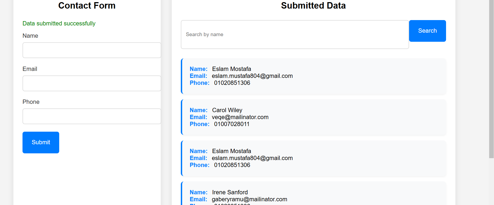
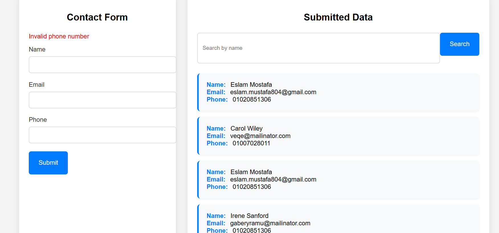
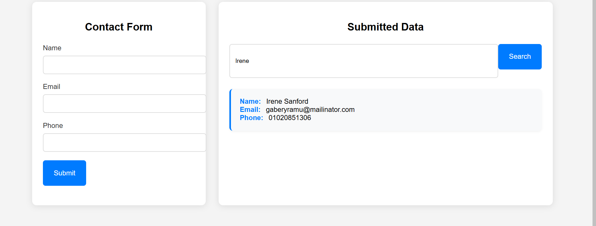

# Project Title

Cat Reload - Project Task 1

##Description


##Features

- **Storing**: Efficiently store data with [brief description of storing feature].
- **Loading**: Quickly load data with [brief description of loading feature].
- **Validation**: Validate data to ensure accuracy and consistency with [brief description of validation feature].
- **Search**: Easily search through data with [brief description of search feature].

## Installation


## Usage

1. Start the server:
    ```sh
    npm start
    ```
2. Open your browser and navigate to `http://localhost:3000`.

## Screenshots

### Storing Data


### Loading Data


### Validation


### Search



## Contact


